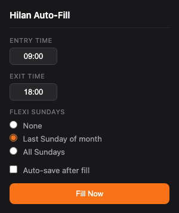

# Hilan Auto-Fill

A Chrome extension that auto-fills the Hilan attendance form with one click.

<p align="center">
  <br><br>
  
</p>

## Features

- **One-click fill** — fills entry and exit times for all loaded days
- **Flexi Sundays** — automatically marks the last Sunday of the month (or all Sundays) as Flexi
- **Smart date handling** — only fills up to and including today, skips future dates
- **Auto-save** — optionally saves the form after filling
- **Persistent settings** — your preferences sync across Chrome profiles
- **Badge indicator** — shows a notification badge when you're on the Hilan attendance page

## Installation

1. **Download** — clone or download this repository:
   ```bash
   git clone https://github.com/oronbz/hilan.git
   ```

2. **Open Chrome Extensions** — navigate to `chrome://extensions/` in your browser

3. **Enable Developer Mode** — toggle the switch in the top-right corner

4. **Load the extension** — click **"Load unpacked"** and select the `hilan` folder you just downloaded

5. **Done!** — you should see the orange **H** icon in your toolbar. Pin it for easy access.

## Usage

1. Navigate to the Hilan attendance page
2. Load the days you want to fill using the calendar (select days, then click "ימים נבחרים")
3. Click the **H** icon in your toolbar
4. Adjust entry/exit times if needed (defaults: 09:00 — 18:00)
5. Click **Fill Now**

The extension fills all loaded days up to today and closes automatically when done.

### Flexi Sundays

- **None** — all days filled as regular attendance
- **Last Sunday of month** (default) — the last Sunday of each month is marked as Flexi (empty hours, report type set to פלקסי). Only applies if that specific Sunday is in the loaded days.
- **All Sundays** — every Sunday is marked as Flexi

### Auto-save

When enabled, the extension automatically clicks the save button after filling. Disabled by default — enable it once you're comfortable with the results.

## Settings

All settings are saved automatically and persist across sessions. They sync across Chrome profiles via `chrome.storage.sync`.

| Setting | Default | Description |
|---------|---------|-------------|
| Entry Time | 09:00 | Daily start time (HH:MM) |
| Exit Time | 18:00 | Daily end time (HH:MM) |
| Flexi Sundays | Last Sunday of month | How to handle Sundays |
| Auto-save | Off | Save form automatically after fill |

## Updating

To update the extension after pulling new changes:

1. Pull the latest version: `git pull`
2. Go to `chrome://extensions/`
3. Click the reload button on the Hilan Auto-Fill card
